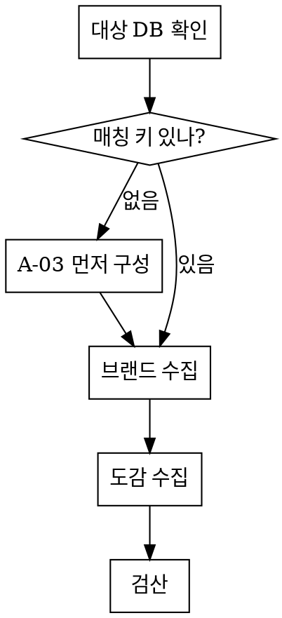

# 카탈로그 수집 — 브랜드·도감

## 개요

브랜드 마스터와 도감을 **카테고리(및 종류) 단위로** 채우는 절차.

**핵심 원칙: 수집의 목적은 건수가 아니라 연결이다.** 유저 아이템과 만나지 않는
도감은 만들지 않은 것보다 나쁘다 — 보유자 0명인 채로 목록을 채우고, 나중에 진짜
도감이 들어올 자리를 선점한다.

## 언제 쓰나

- 카테고리에 도감이 0건이거나 얇다
- 새 종류(subtype)를 만들었고 그 종류의 도감이 비어 있다
- 브랜드 마스터에 없는 브랜드 요청(A-12)이 반복해서 들어온다
- 도감에 **다른 카테고리 물건**이 섞여 있다
- 보유자 0명 도감이 쌓인다
- **종류 축을 새로 도입했거나 종류를 추가해서 기존 도감을 나눠야 한다** (§6)
- 카테고리 도감 탭에 `미분류 도감 N건` 경고가 떠 있다

**쓰지 않는 경우**: 운동(`workout`) — 도감을 어드민이 A-17에서 직접 만든다
(D-227·D-228). 이 절차의 브랜드·매칭 키 전제가 성립하지 않는다.

## 순서를 바꾸지 않는다



**브랜드가 도감보다 먼저다.** `brand`가 매칭 키인 카테고리(자전거·옷·캠핑·
데스크테리어)에서 `insertCodex`는 브랜드 마스터를 통과하지 못한 도감을 거부한다
(D-043·D-044). 순서를 뒤집으면 조사 결과가 통째로 버려진다.

## 1. 대상 DB를 먼저 출력한다

```bash
pnpm db:which
```

⚠️ **이걸 건너뛰지 않는다.** `DATABASE_URL`이 Supabase를 가리킬 수 있고
(D-117), CLI가 앱과 **다른 DB**를 보던 사고가 있었다 (D-226). 수집은 대량 쓰기라
잘못된 DB에 들어가면 되돌리기 어렵다.

## 2. 매칭 키가 구성돼 있는지 확인

카테고리 상세 `매칭 키` 탭(`/admin/categories/[key]/matching-key`)에서 본다.
비어 있으면 `insertCodex`가 거부한다:

> 이 카테고리의 매칭 키가 아직 구성되지 않았습니다 (A-03)

⚠️ **여기서 `uniqueId`를 가정하고 넣지 않는다.** 나중에 운영이 실제 매칭 키를
정하는 순간 그때 넣은 도감만 다른 규칙으로 남는다.

## 3. 브랜드 수집

| 규모 | 방법 |
|---|---|
| 수십~수백 건 (초기 시딩) | CSV → `pnpm db:import-brands` |
| 소량 증분 | A-11 브랜드 마스터 화면 |
| 카테고리/종류 연결만 조정 | A-01 상세 `연결 브랜드` 탭 |

CSV 스키마는 `prisma/brands.csv` 참고:
`brandName,aliasKo,aliasJa,aliasEn,categories` (다중값 구분자 `;`)

⚠️ **alias를 비우지 않는다** (D-047). 한국 유저가 "롤렉스"로 검색해도 `Rolex`가
안 나오면 **브랜드가 없는 것으로 오인**하고 추가 요청을 보낸다 — 어드민이 그걸 또
처리하는 순환이 생긴다. A-11이 alias 누락 건수를 경고하는 이유다.

⚠️ **`db:import-brands`는 카테고리 축의 SoT다.** CSV에서 빠진 카테고리는 연결이
제거된다(그 카테고리의 종류 연결까지). 어드민이 종류로 좁혀둔 설정은 카테고리가
CSV에 남아 있는 한 보존된다.

## 4. 도감 수집

```bash
pnpm db:research-codex <categoryKey> [브랜드당 건수] [브랜드명] [힌트] [--subtype=키]
```

```bash
pnpm db:research-codex watch 5           # 시계 브랜드마다 5건
pnpm db:research-codex shoes 5 Nike      # 특정 브랜드만
```

**로컬 전용이다** (D-146·D-185) — 프로덕션 런타임에 `claude` 바이너리가 없다.
화면(A-04 · A-01 상세 도감 탭)은 한 건씩 확인하며 넣는 용도이고, 이 스크립트는
브랜드 수십 개를 훑는 용도다.

### ⚠️ 조사분은 전부 미검증이다

사람이 식별 값을 확인하지 않았다. **`VERIFIED`로 넣을 방법을 만들지 않는다** —
검증 배지는 신뢰 신호이고, 지어낸 값이 그 배지를 달면 도감 전체가 의심받는다
(D-015·D-033). A-05 검수를 거친다.

### ⚠️ 힌트에 카테고리를 박는다 — 겸업 브랜드가 카테고리를 넘어온다

**실제로 캠핑 223건 중 19건이 의류·신발이었다** (D-216) — `Arc'teryx Alpha SV
Jacket`, `Patagonia Down Sweater Jacket`, `Merrell Trail Glove 7`. 옷·캠핑 겸업
브랜드가 10개인데 **그 브랜드에서 가장 유명한 것이 옷**이라, "대표 제품 5개"라는
힌트가 옷을 가져왔다.

새 카테고리·종류를 수집할 때 `research-codex.ts`의 `defaultHint()`에 **무엇을
수집하고 무엇을 제외하는지** 명시한다. 브랜드 이름만 말하면 그 공백을 유명세가
메운다.

### ⚠️ 종류를 지정했으면 **힌트에도 종류를 박는다** — 같은 함정의 한 층 아래

**이 함정은 카테고리 층에서 막아도 종류 층에서 다시 열린다.** 실제로 겪었다
(D-262): `--subtype=sleeping-bag` 으로 돌렸는데 `defaultHint()` 가 종류를 몰라
힌트가 여전히 "대표 캠핑 장비" 였다. 결과:

```
Coleman Classic Propane Stove  → sleeping-bag 으로 저장  ❌
Barebones Railroad Lantern     → sleeping-bag           ❌
Arc'teryx Mantis 26 Backpack   → sleeping-bag           ❌
```

**화면상으로는 정상으로 보인다** — 유저가 침낭을 등록하면 그 버너·랜턴 도감과
만난다. 조용히 망가지는 쪽이라 더 위험하다.

지금은 `defaultHint()` 가 종류를 받아 처리한다. **새 카테고리를 추가할 때 이
분기를 빠뜨리지 말 것.**

### ⚠️ **0건이 정답일 수 있다** — 안 만드는 브랜드에 억지로 채우지 않는다

한 종류를 카테고리의 전 브랜드에 물으면 **대부분은 그걸 안 만든다.** Barebones
는 랜턴·화로 브랜드라 침낭이 없다. 프롬프트가 빈 배열을 허용하지 않으면 모델이
지어낸다.

고친 뒤 확인: Barebones **0건**(정상), Coleman·Nemo·Rab 은 전부 진짜 침낭.

### ⚠️ 식별 단위가 카테고리마다 다르다

| 카테고리 | 단위 | 함정 |
|---|---|---|
| 시계 | 레퍼런스 번호 | 공개하지 않는 브랜드가 있다 — 0건이 정상 |
| 신발 | **배색 스타일 코드** (D-189) | "대표 모델 5개"로는 특정되지 않아 빈 배열이 온다 (D-188). 배색을 지정하게 한다 |
| 자전거 | `brand+model+year` 복합 | 부품은 연식이 무의미할 수 있다 |
| 캠핑·옷·데스크테리어 | `brand+model` | 고유 ID가 없다 |

### ⚠️ 모르면 내지 않게 한다

`Baltic` 5건의 고유번호가 **명칭 슬러그**(`baltic-aquascaphe-dual-crown`)로 들어온
적이 있다 (D-186). 레퍼런스 번호가 없는 브랜드라는 상황을 프롬프트가 다루지 않아서
모델이 그럴듯한 값을 만들었다. 그 도감은 유저 아이템과 영원히 만나지 않는다.

코드 가드가 있다(고유번호가 명칭과 같음 / 숫자 없음 → 제외) — **`uniqueId`에만**
적용된다. 전체 키에 걸면 운동처럼 명칭이 곧 키인 카테고리가 전멸한다.

## 5. 검산 — 건수가 아니라 연결을 본다

```bash
pnpm db:export-codex   # 현재 상태 스냅샷
```

| 확인 | 왜 |
|---|---|
| 0건 브랜드가 **왜** 0건인지 | 제외 사유 없이 0건이면 모델이 빈 배열을 낸 것이다. D-188에서 이 구분이 안 돼 원인을 두 번 잘못 짚었다 |
| 고유값이 명칭 슬러그가 아닌지 | D-186 재발 |
| 다른 카테고리 물건이 없는지 | D-216. 종류가 있는 카테고리면 **어느 종류에도 안 맞는 것이 곧 오분류 신호** |
| 매칭 키가 실제로 채워졌는지 | `CodexMatchKey`에 PRIMARY 행이 없으면 도감은 있는데 매칭으로 영원히 닿지 않는다 |
| **넣은 종류와 실제 물건이 맞는지** | D-262. 명칭 몇 개만 봐도 드러난다 — 침낭 요청에 `Propane Stove`가 있으면 힌트가 종류를 안 박은 것이다 |
| 매칭 키의 scope가 도감과 같은지 | 갈리면 그 도감은 매칭으로 안 닿는다. `CodexMatchKey.scopeId <> CodexItem.scopeId` 가 0이어야 한다 |

**오염분은 옮기지 말고 지운다.** 카테고리 이동은 간단하지 않다 — 유일성 범위와
`CodexMatchKey`의 스코프 사본이 함께 움직여야 한다. 선례가 `db:fix-camping-mix`다.

## 6. 이미 있는 도감을 종류로 나눈다

수집이 아니라 **분류**다. 종류 축을 새로 도입했거나, 종류를 추가했을 때 쓴다.

```bash
pnpm db:classify-codex camping           # AI 제안 → prisma/data/classify-camping.csv
pnpm db:classify-codex camping --apply   # 사람이 훑고 고친 뒤 적용
```

손으로 고칠 때는 **카테고리 상세 도감 탭의 종류 셀렉트**를 쓴다.

### ⚠️ 제안과 적용을 분리한다

**수집은 틀려도 도감이 하나 늘 뿐이지만, 분류는 있던 연결을 끊는다.** 잘못된
종류로 들어가면 유저 아이템과 안 만나는데 **화면상으로는 정상으로 보인다.**

### ⚠️ `unknown` 을 두 가지로 갈라 본다 — 조치가 정반대다

| 유형 | 뜻 | 조치 |
|---|---|---|
| 어느 종류에도 안 맞음 + **이 카테고리 제품이 아님** | 오염 (D-216) | 삭제 또는 이관 |
| 어느 종류에도 안 맞음 + **그 카테고리 제품은 맞음** | **종류 체계의 공백** | **종류를 추가** |

실제로 캠핑 208건에서 `unknown` 84건이 나왔는데 **종류 부재(~50)가 오염(~25)보다
두 배**였다 (D-258). 조리도구·물병 종류를 더하니 84 → 63 으로 줄었다.

**먼저 지우려 했으면 50건을 잘못 버렸다.**

### ⚠️ 카테고리를 넘는 이관은 다른 문제다

같은 카테고리 안의 종류 이동은 도감 탭에서 된다. **카테고리가 바뀌면**
`CodexMatchKey` 의 `categoryId` 사본과 **연결된 유저 아이템의 카테고리**까지
움직여야 한다 — 일회성 스크립트로 하고, **보유자가 있으면 멈춘다**(유저의 방
진열이 이동한다). 선례가 `migrate-camping-to-hiking.ts` 다.

## 흔한 실수

| 실수 | 결과 |
|---|---|
| 도감을 브랜드보다 먼저 수집 | 브랜드 마스터 게이트에서 전량 거부 |
| `pnpm db:which` 생략 | 운영 DB에 대량 쓰기 (D-226) |
| 조사분을 `VERIFIED`로 | 지어낸 값이 신뢰 배지를 단다 |
| 힌트에 카테고리를 안 박음 | 겸업 브랜드가 옷·신발을 가져온다 (D-216) |
| 힌트에 **종류**를 안 박음 | 버너·랜턴·배낭이 침낭으로 저장된다 (D-262) |
| 안 만드는 브랜드에 0건을 허용 안 함 | 모델이 지어낸다. **0건이 정답일 수 있다** |
| 미분류가 남았는데 필수화 | 유저가 고른 스코프가 비어 중복 도감이 생긴다 (D-257) |
| 0건을 "브랜드가 없어서"로 단정 | 제외 사유를 봐야 안다 (D-188) |
| 건수로 성과를 판단 | 보유자 0명 도감은 자리만 차지한다 |

## 종류(subtype)가 있는 카테고리

자전거·캠핑은 종류가 있다. 도감 스코프가 **종류 단위**로 갈리므로
(`@@unique([scopeId, normalizedKey])`), 종류 스코프 아이템은 카테고리 스코프
도감과 **만나지 않는다.**

### 종류를 지정해 수집한다

```bash
pnpm db:research-codex bicycle 5 Shimano --subtype=drivetrain
```

`--subtype=` 은 **명명 플래그**다 — 위치 인자(`카테고리 · 건수 · 브랜드 · 힌트`)
뒤에 순서 상관없이 붙인다.

⚠️ **종류가 필수인 카테고리(`Category.subtypeRequired`)에서 종류 없이 돌리면
AI 호출 전에 막힌다.** 고를 수 있는 종류 목록을 출력하므로 그중에서 고른다.
막는 이유는 카테고리 스코프에 도감이 생기면 **유저 아이템과 영원히 만나지 않아
조사 비용만 쓰고 연결이 0이 되기** 때문이다.

| 카테고리 | 종류 | 수집 |
|---|---|---|
| 시계·신발·옷·데스크테리어 | 없음 | 그대로. `scopeId == categoryId` |
| 자전거 | **필수** (8종, 완성차 포함) | `--subtype=` 지정 필수 |
| 캠핑 | **필수** (10종) | `--subtype=` 지정 필수 |
| 등산 | **필수** (배낭·등반장비) | `--subtype=` 지정 필수 |

### ⚠️ 필수화는 **미분류가 0이 된 뒤에** 켠다

미분류 도감이 남아 있는데 종류를 필수로 켜면, 유저가 고른 종류 스코프에 도감이
없어 **기존 도감과 못 만나고 중복이 생긴다** (D-257). 카테고리 도감 탭의
`미분류 도감 N건` 경고가 0이 되어야 켤 수 있다.

**순서가 거꾸로면 조용히 망가진다** — 필수화 전에 재수집하면 새 도감이 카테고리
스코프로 들어가 다시 미분류가 된다.

## 이 스킬의 상태

⚠️ **`superpowers:writing-skills` 가 요구하는 서브에이전트 baseline 테스트는
거치지 않았다.** "이 문서를 읽은 에이전트가 실제로 실수를 피하는가" 는 확인되지
않았다.

**다만 한 번 실제로 써봤고, 그 과정에서 문서가 부족한 곳이 드러났다** (2026-08-29,
캠핑 도감 정리 + 등산 카테고리 신설):

| 겪은 것 | 문서에 반영 |
|---|---|
| 종류를 지정했는데 힌트가 카테고리 수준이라 **버너·랜턴이 침낭으로 저장** | "종류를 지정했으면 힌트에도 종류를 박는다" (D-262) |
| 안 만드는 브랜드에 억지로 채워짐 | "0건이 정답일 수 있다" |
| 미분류가 남은 채 필수화하면 중복 도감 | "필수화는 미분류 0이 된 뒤" (D-257) |
| 높은 `unknown` 을 오염으로 오독할 뻔함 | 분류 절의 "종류 부재 vs 오염" 구분 (D-258) |

**가장 값진 교훈**: 이 문서가 "힌트에 카테고리를 박는다"(D-216)를 이미 적어뒀는데,
**종류 축이 생기면서 같은 함정이 한 층 아래에서 다시 열렸다.** 새 축을 추가할 때
기존 경고가 그 축에도 적용되는지 확인할 것.

내용의 근거는 기존 도구 주석과 D-185·D-186·D-188·D-189·D-216·D-226·D-257·D-258·
D-262 의 실제 사고 기록, D-043·D-044·D-047 의 브랜드 규칙이다.
